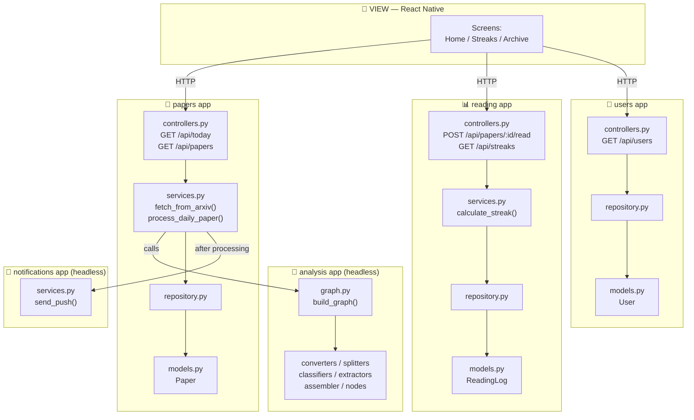
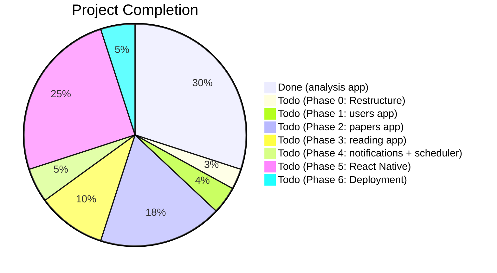

# Research AI Agent — Full Project Audit & Roadmap (Django-Style MVC)

## Your Vision

A personal app for **you and your wife only** that:
1. **Daily** picks a random AI research paper → AI agent analyzes & summarizes it
2. **Sends** the summary to both your phones (push notification / in-app)
3. **Tracks a reading streak** — both of you can see each other's progress
4. **Zero cost** — no paid APIs, no paid hosting, no paid services

**Tech stack:** LangGraph + FastAPI + React Native

---

## 🟢 What Is DONE

The LangGraph research paper analysis pipeline — 16 source files, 10 node wrappers, 12 unit tests. Fully working. Details in previous audit (unchanged).

---

## 🔴 What Is NOT Done

Paper fetching, database, API, scheduler, notifications, React Native app, streak system, deployment.

---

## 🏗️ Django-Style MVC Architecture

> [!IMPORTANT]
> **Django-style = each feature is its own self-contained app.** Every app has its own `models.py`, `schemas.py`, `controllers.py`, `services.py`, `repository.py` — all co-located. No global `models/` or `controllers/` folders. Just like Django apps.

### The 5 Feature Apps

| App | Purpose | Has Controllers? |
|-----|---------|:-:|
| **`papers`** | Paper CRUD, arXiv fetching, today's paper | ✅ Yes |
| **`analysis`** | LangGraph AI pipeline (your existing code lives here) | ❌ No — headless app |
| **`reading`** | Reading logs, streak tracking, streak comparison | ✅ Yes |
| **`users`** | User profiles, push tokens | ✅ Yes |
| **`notifications`** | Push notification delivery | ❌ No — called by services |

### Where Does The LangGraph Graph Go?

> [!TIP]
> **The `analysis` app IS your existing LangGraph pipeline.** It's a "headless" app — like a Django app that has models and utility functions but no views/URLs. It exposes one function: `run_pipeline(pdf_path) → PaperSummary`. The `papers` app calls it.
>
> Its internal sub-structure (converters, splitters, classifiers, extractors, assembler, nodes, sinks) stays **exactly as-is** inside the app. No reorganization needed.

```
# How papers calls analysis:

# papers/services.py
from analysis.graph import build_graph
from analysis.state import initial_state

def process_paper(pdf_path: str) -> PaperSummary:
    graph = build_graph()
    result = graph.invoke(initial_state(pdf_path))
    return result["paper_summary"]
```

### Full Folder Structure

```
Research-AI-Agent-/
│
├── main.py                              # FastAPI app: mounts all routers, lifespan
├── pyproject.toml
├── .env / .env.dev
│
├── src/
│   │
│   ├── core/                            # Project-wide config (like Django settings.py)
│   │   ├── __init__.py
│   │   ├── config.py                    # Pydantic Settings: env vars, constants
│   │   ├── db.py                        # SQLite engine, SessionLocal, get_db()
│   │   └── scheduler.py                 # APScheduler: daily job wiring
│   │
│   │   ═══════════════════════════════════════════════════════
│   │                        FEATURE APPS
│   │   ═══════════════════════════════════════════════════════
│   │
│   ├── papers/                          # 📄 Paper management app
│   │   ├── __init__.py
│   │   ├── models.py                    # Paper ORM model
│   │   ├── schemas.py                   # PaperResponse, PaperListItem, TodayResponse
│   │   ├── repository.py               # Paper CRUD (create, get_by_id, get_by_date, list)
│   │   ├── services.py                 # fetch_from_arxiv(), process_daily_paper(), get_today()
│   │   └── controllers.py              # APIRouter: /api/today, /api/papers, /api/papers/{id}
│   │
│   ├── analysis/                        # 🤖 LangGraph pipeline app (HEADLESS — no controllers)
│   │   ├── __init__.py                  # exports: run_pipeline()
│   │   ├── graph.py                     # ✅ EXISTING — graph assembly
│   │   ├── state.py                     # ✅ EXISTING — PipelineState
│   │   ├── schemas.py                   # ✅ EXISTING — PaperSummary
│   │   ├── interfaces.py               # ✅ EXISTING — Protocol classes
│   │   ├── config.py                    # ✅ EXISTING — HuggingFace LLM setup
│   │   ├── converters/                  # ✅ EXISTING
│   │   │   └── pymupdf_converter.py
│   │   ├── splitters/                   # ✅ EXISTING
│   │   │   └── heading_splitter.py
│   │   ├── classifiers/                 # ✅ EXISTING
│   │   │   └── llm_classifier.py
│   │   ├── extractors/                  # ✅ EXISTING
│   │   │   ├── title_extractor.py
│   │   │   ├── methods_extractor.py
│   │   │   ├── experiments_extractor.py
│   │   │   ├── limitations_extractor.py
│   │   │   └── summary_extractor.py
│   │   ├── assembler/                   # ✅ EXISTING
│   │   │   └── result_assembler.py
│   │   ├── nodes/                       # ✅ EXISTING — all 10 node wrappers
│   │   │   └── ...
│   │   └── sinks/                       # ✅ EXISTING (Notion — optional, can keep or drop)
│   │       └── notion_sink.py
│   │
│   ├── reading/                         # 📊 Reading logs + streaks app
│   │   ├── __init__.py
│   │   ├── models.py                    # ReadingLog ORM model
│   │   ├── schemas.py                   # StreakResponse, StreakComparisonResponse
│   │   ├── repository.py               # mark_as_read(), get_reading_dates(), is_read()
│   │   ├── services.py                 # calculate_streak(), get_longest(), get_comparison()
│   │   └── controllers.py              # APIRouter: /api/papers/{id}/read, /api/streaks
│   │
│   ├── users/                           # 👤 User management app
│   │   ├── __init__.py
│   │   ├── models.py                    # User ORM model
│   │   ├── schemas.py                   # UserResponse
│   │   ├── repository.py               # get_user(), get_all(), update_push_token()
│   │   └── controllers.py              # APIRouter: /api/users, /api/users/{id}/push-token
│   │
│   └── notifications/                   # 🔔 Push notifications app (HEADLESS — no controllers)
│       ├── __init__.py
│       └── services.py                  # send_push_to_all(), send_push_to_user()
│
├── tests/                               # Mirrors app structure
│   ├── analysis/                        # ✅ EXISTING tests move here
│   │   ├── test_splitter.py
│   │   ├── test_classifier.py
│   │   ├── test_extractors.py
│   │   └── test_assembler.py
│   ├── papers/
│   │   ├── test_paper_service.py
│   │   └── test_paper_repository.py
│   ├── reading/
│   │   ├── test_streak_service.py
│   │   └── test_reading_repository.py
│   └── users/
│       └── test_user_repository.py
│
└── mobile/                              # 📱 React Native (THE VIEW)
    └── ResearchApp/
        ├── app/
        │   ├── (tabs)/
        │   │   ├── index.tsx            # Home — today's paper
        │   │   ├── streaks.tsx          # Streak dashboard
        │   │   └── archive.tsx          # Paper archive
        │   └── paper/
        │       └── [id].tsx             # Paper detail
        ├── components/
        ├── services/api.ts
        └── constants/theme.ts
```

### How The Apps Talk To Each Other



### Per-App Rules (Django-Style)

| File | Role | Rule |
|------|------|------|
| `models.py` | ORM table definitions | Only defines database tables. No logic. |
| `schemas.py` | Pydantic request/response DTOs | Shapes what the API sends/receives. Separate from ORM models. |
| `repository.py` | Raw data access | Only SQL/ORM queries. No business logic. Returns ORM objects. |
| `services.py` | Business logic | The brain. Calls repository, calls other apps' services, does computation. |
| `controllers.py` | FastAPI router | **Thin.** Parse request → call service → return schema. Zero logic. |
| `__init__.py` | Public API of the app | Exports what other apps are allowed to import. |

### Cross-App Import Rules

```python
# ✅ ALLOWED — services can import other apps' services
# papers/services.py
from analysis import run_pipeline          # analysis app's public API
from notifications.services import send_push_to_all

# ✅ ALLOWED — controllers import their own app's services
# papers/controllers.py
from papers.services import get_today

# ❌ FORBIDDEN — controllers never import another app's internals
# papers/controllers.py
from reading.repository import mark_as_read  # BAD — go through reading.services

# ❌ FORBIDDEN — apps never import another app's models directly
# reading/services.py
from papers.models import Paper  # BAD — use papers.repository or papers.services
```

---

## 🗺️ Roadmap — Step by Step

> [!IMPORTANT]
> **Zero-cost constraint** drives every technology choice. All services have permanent free tiers.

### Phase 0: Restructure into Django-Style Apps (0.5 day)

| Task | Details |
|------|---------|
| Create app directories | `src/papers/`, `src/analysis/`, `src/reading/`, `src/users/`, `src/notifications/` each with `__init__.py` |
| Move existing pipeline | Move everything from `src/modules/research-analysis/` → `src/analysis/` (flat move, internal structure unchanged) |
| Add `analysis/__init__.py` | Export `run_pipeline(pdf_path) → PaperSummary` as the app's public API |
| Wire `main.py` | Import routers from `papers.controllers`, `reading.controllers`, `users.controllers`, mount them |
| Fill `src/core/config.py` | Pydantic `Settings` class reading from `.env` |
| Fill `src/core/db.py` | SQLite engine + `SessionLocal` + `get_db()` |
| Move tests | `tests/test_splitter.py` → `tests/analysis/test_splitter.py`, etc. |
| Delete old dirs | Remove empty `src/modules/summaries/`, `src/modules/` |

---

### Phase 1: Users App (0.5 day)

| File | What Gets Built |
|------|-----------------|
| `users/models.py` | `User` table: `id`, `name`, `push_token` (nullable) |
| `users/schemas.py` | `UserResponse(id, name)` |
| `users/repository.py` | `get_user()`, `get_all_users()`, `update_push_token()` |
| `users/controllers.py` | `GET /api/users`, `PUT /api/users/{id}/push-token` |
| DB seeding | Auto-create 2 hardcoded users on startup (you & wife) |

---

### Phase 2: Papers App (2-3 days)

The biggest backend app — it owns arXiv fetching, pipeline invocation, and paper storage.

| File | What Gets Built |
|------|-----------------|
| `papers/models.py` | `Paper` table: `id`, `arxiv_id` (unique), `title`, `summary_json` (TEXT — stores PaperSummary as JSON), `pdf_url`, `abstract`, `created_at` |
| `papers/schemas.py` | `PaperResponse` (expands summary_json into fields), `PaperListItem`, `TodayResponse` |
| `papers/repository.py` | `create_paper()`, `get_by_id()`, `get_today()`, `list_papers()`, `exists_by_arxiv_id()` |
| `papers/services.py` | `fetch_random_from_arxiv()` — arXiv REST API, random pick from `cs.AI`/`cs.LG`, PDF download. `process_daily_paper()` — calls `analysis.run_pipeline()` → saves to DB → calls `notifications.services.send_push_to_all()`. `get_today()`, `get_paper_detail()` |
| `papers/controllers.py` | `GET /api/today`, `GET /api/papers`, `GET /api/papers/{id}` |

---

### Phase 3: Reading App + Streaks (1 day)

| File | What Gets Built |
|------|-----------------|
| `reading/models.py` | `ReadingLog` table: `id`, `user_id` (FK→User), `paper_id` (FK→Paper), `read_at`. Unique constraint on `(user_id, paper_id)` |
| `reading/schemas.py` | `StreakResponse(user_name, current_streak, longest_streak, total_read)`, `StreakComparisonResponse(you, partner)` |
| `reading/repository.py` | `mark_as_read()`, `is_read()`, `get_reading_dates_for_user()` |
| `reading/services.py` | `calculate_streak(user_id)` — query dates → count consecutive days backwards. `get_comparison()` — both users side-by-side. `get_longest_streak(user_id)` |
| `reading/controllers.py` | `POST /api/papers/{id}/read`, `GET /api/streaks`, `GET /api/users/{id}/streak` |

---

### Phase 4: Notifications App + Scheduler (1 day)

| File | What Gets Built |
|------|-----------------|
| `notifications/services.py` | `send_push_to_all(title, body)` — Expo Push Notifications (free) or Telegram Bot (free). Reads push tokens from `users.repository` |
| `core/scheduler.py` | APScheduler `AsyncIOScheduler` — runs `papers.services.process_daily_paper()` daily at a fixed time (e.g., 7 AM). Wired into FastAPI lifespan. Retry 3x on failure |

---

### Phase 5: React Native App — The View (5-7 days)

| Screen | Calls |
|--------|-------|
| **Home** | `GET /api/today` → paper card + "Mark as Read ✓" → `POST /api/papers/{id}/read` |
| **Streaks** | `GET /api/streaks` → your streak 🔥 vs. wife's streak 🔥 |
| **Archive** | `GET /api/papers` → scrollable list by date |
| **Paper Detail** | `GET /api/papers/{id}` → full breakdown |

| Task | Details |
|------|---------|
| Init Expo | `npx create-expo-app@latest mobile/ResearchApp` |
| Routing | Expo Router with tabs |
| API client | `services/api.ts` — Axios to FastAPI |
| Components | `PaperCard`, `StreakBadge`, `StreakComparison`, `ReadButton` |
| Push | Expo Notifications SDK → register token → `PUT /api/users/{id}/push-token` |

---

### Phase 6: Deployment (1 day)

| Component | Free Option |
|-----------|-------------|
| **FastAPI backend** | Your PC + Cloudflare Tunnel (free) or Render free tier |
| **SQLite** | File on same machine |
| **Mobile app** | Expo Go on both phones (no App Store needed) |

---

## ⚠️ Decisions Needed

> [!WARNING]
> ### HuggingFace Free Tier Rate Limits
> ~100 requests/day free. Your pipeline uses ~5 calls/paper. Fine for 1 paper/day.

> [!IMPORTANT]
> ### Notion → Removed or Optional?
> In this plan, the `analysis` app still has `sinks/notion_sink.py`. The `papers` app saves to SQLite instead. Want to **drop Notion entirely**, or keep it as an optional secondary write?

> [!IMPORTANT]
> ### Authentication
> Since it's only 2 users:
> - **No auth at all** (API is private on your network / tunneled)
> - **Simple hardcoded tokens** (each phone sends a header to identify who)
> - **PIN-based** (4-digit PIN per user)

> [!IMPORTANT]
> ### Hosting
> - **Option A**: Your PC 24/7 + Cloudflare Tunnel ($0, PC must stay on)
> - **Option B**: Render.com free tier (cold starts ~30s)
> - **Option C**: Railway free tier ($5 credit/month)

---

## 📊 Summary



## 📅 Timeline

| Phase | Estimated Time |
|-------|---------------|
| Phase 0: Restructure | 0.5 day |
| Phase 1: Users App | 0.5 day |
| Phase 2: Papers App | 2-3 days |
| Phase 3: Reading App | 1 day |
| Phase 4: Notifications + Scheduler | 1 day |
| Phase 5: React Native App | 5-7 days |
| Phase 6: Deployment | 1 day |
| **Total** | **~11-13 days** |
